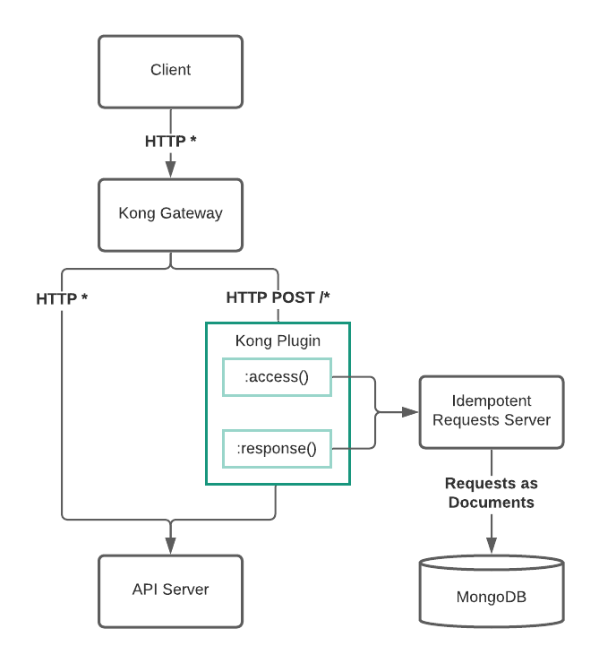

# Kong plugin for Idempontent Requests

This [Kong](https://github.com/kong/kong) plugin acts as a client for [`checkr/idempotent-requests`](https://github.com/checkr/idempotent-requests) server.
It follows behaviors described in [IETF draft for standardized `Idempotency-Key` header](https://datatracker.ietf.org/doc/html/draft-ietf-httpapi-idempotency-key-header-00).

⚠️ Important note: this plugin requires requests and responses to be buffered within Kong. As of the moment of publishing this document,
Kong does not support it in case of `HTTP/2` and `gRPC` (due to the underlying Nginx limitation).

## Example data flow


## Configuration

| Config | Required | Default | Explanation |
| --- | --- | --- | --- |
| `idempotent_requests_server_url` | yes | N/A | Idempotent Requests server URL |
| `idempotency_key_header_name` | no | `Idempotency-Key` | HTTP header name with Idempotency Key |
| `timeout` | no | `30000` | Timeout (msec) to talk with Idempotent Requests server  |

### Example `deck` configuration

```yaml
  plugins:
    - name: idempotent-requests
      enabled: true
      protocols:
        - http
        - https
      config:
        idempotent_requests_server_url: "http://idempotent-requests-server:8080"
```

## Setup

```shell
# Lua dependency management
brew install luarocks

# linter
luarocks install luacheck

# testing framework
luarocks install busted
```

## Running Integration Tests Locally

1. Check out `https://github.com/checkr/idempotent-requests` into `../idempotent-requests`
2. Check out `https://github.com/Kong/kong-pongo` into `../../kong/kong-pongo`

```shell
# Run Kong Pongo
../../kong-pongo/pongo.sh up
../../kong-pongo/pongo.sh build

# Run Idempotent Requests Server
docker-compose -f ../idempotent-requests/docker-compose.yml \
  -f ../idempotent-requests/docker-compose.server.yml \
  -f ../idempotent-requests/docker-compose.mongo-express.yml \
  -f docker-compose.network.yml up -d

# Run Lint
../../kong-pongo/pongo.sh lint

# Run Integration Tests
../../kong-pongo/pongo.sh run
```
